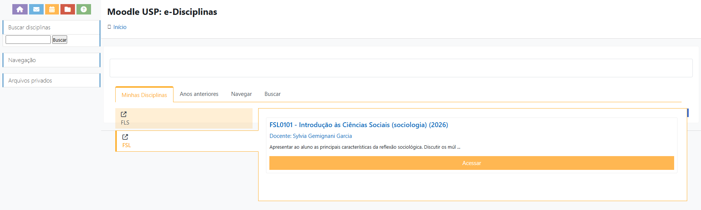
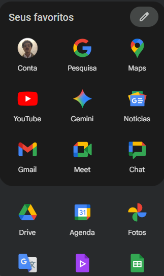
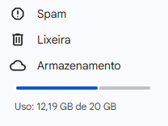

## Esclarecimentos

Os monitores do PLEA têm bastante arbitrariedade para dar as notas, as monitorias e definir a sua forma de trabalho. Isso significa que a minha forma de trabalho muito provavelmente não vai ser a forma de outro monitor. Ou seja, a experiência de vocês enquanto grupo será diferente das experiências dos seus colegas, porque os monitores são diferentes. O PLEA tem uma diretriz geral, que todos seguem de comum acordo, mas a metodologia de trabalho é diferente a depender do monitor.

## Comunicação institucional

Os professores utilizam a [Plataforma Moodle](https://edisciplinas.usp.br/acessar/) (USP e-Disciplinas) para emitir comunicados, disponibilizar os textos e fazer alterações no programa. Para acessar o Moodle, basta inserir as suas credenciais como número USP ou o e-mail USP e a senha que vocês utilizam. Na guia “Meus Ambientes”, vocês poderão localizar a disciplina, conforme a imagem abaixo:

Acessando o ambiente virtual da disciplina, vocês conseguirão ver as informações necessárias para o andamento do curso. 

A nossa comunicação se dará, principalmente, pelo envio de e-mails. Para isso, vocês precisam ter e usar o e-mail que termina com @usp.br, o qual vocês provavelmente já têm acesso. Por meio do e-mail, vocês terão acesso a uma série de ferramentas do chamado [Google Workspace](https://workspace.google.com/intl/pt-BR/business/?utm_source=google&utm_medium=cpc&utm_campaign=1710048-Workspace-DR-LATAM-BR-pt-Google-BKWS-EXA-LUAC0011904&utm_content=c-Hybrid+%7C+BKWS+-+EXA+%7C+Txt-Google+Workspace-43700057748921993&utm_term=google%20workspace&gad_source=1&gclid=Cj0KCQjw4cS-BhDGARIsABg4_J2tmA_s-FYWpZpL92SSb0JN-otg-5v5k8uG2pFfoWugeGI5DlHYDA0aAo8cEALw_wcB&gclsrc=aw.ds) de maneira gratuita, como demonstrado abaixo:

Se vocês acessarem o Drive, verão que no canto inferior esquerdo há uma indicação de armazenamento. Atentem-se pois o limite é de 20GB. É relativamente bastante. Eu sugiro que vocês não vinculem o Google Fotos, por exemplo, ao @usp.br de vocês porque pode ser que ocupe mais espaço do que o desejado. Eu já passei pela graduação e agora na pós-graduação tenho bastante espaço disponível:

Além disso, vamos utilizar um grupo de Whatsapp <i class="fa-brands fa-whatsapp"></i> para otimizar a nossa comunicação. Vocês terão o meu contato pessoal lá. Percebam que o Whatsapp <i class="fa-brands fa-whatsapp"></i> traz uma proximidade e celeridade maior na comunicação. Mas, é importante frisar que isso não quer dizer que todos nós teremos disponibilidade o tempo todo. Da minha parte, estou disponível todos os dias úteis entre 10h e 18h para vocês, onde os responderei dentro de um intervalo de 12h. Fiquem à vontade para me contatar e tirar dúvidas pontuais. 

Para a minha segurança e a de vocês, alinhado com uma certa conduta de boas práticas, temas mais sérios como *abono de faltas, justificativas de atrasos, dificuldades gerais e afins*, podem ser sim comunicados pelo Whatsapp. Entretanto, é altamente recomendável que vocês enviem, também, um e-mail formalizando a comunicação. Isso faz com que vocês mantenham o histórico das nossas interações, registrando-as. Especialmente sobre as faltas, recomendo fortemente que sejam comunidados tanto os monitores da disciplina quanto o professor responsável. É interessante esclarecer os motivos da falta, bem como cópias de atestado etc^["Reportar" as faltas é mais comum quando você está no limite de ausências numa disciplina.].

:::{.callout-important}
É importante que vocês estejam apropriados do [Programa da Disciplina](https://drive.google.com/drive/u/1/folders/17sKx6atJyhBa1rMTlpp88WsPNz4QU_RP). Nele, vocês encontrarão todas as datas, temas e leituras para as aulas. O programa  pode ser alterado ao longo do semestre, mas, caso isso aconteça, vocês serão devidamente comunicados pelo professor e sua equipe. **Um conselho**: antes de tirarem alguma dúvida comigo, algum professor ou outro colega, verifiquem o programa! Frequentemente, a sua dúvida já pode ter sido sanada em alguma parte do programa da disciplina. Entretanto, não hesitem em entrar em contato, principalmente comigo. Meu objetivo também é contribuir para uma boa experiência e fazer com que as coisas sejam mais nítidas e compreensíveis. 
:::

## Envio de fichamentos

Em relação ao envio de fichamentos, estão previstas 05 (cinco) entregas ao longo do semestre. Por cima, dá uma média de 01 fichamento a cada 15 dias. É um tempo bastante hábil para fazer as leituras e a escrita do fichamento. Organizem-se para cumprir essa atividade. Obviamente, esta não será a única disciplina de vocês, tampouco a única atividade que vocês terão ao longo deste semestre no curso de Ciências Sociais. Isso quer dizer que imprevistos são esperados! Caso vocês tenham algum empecilho no envio dos fichamentos, basta me comunicar formalmente por e-mail, conforme orientado no ponto anterior. 

Algumas regras para o envio de fichamentos:

i) Só serão aceitos fichamentos no formato **.docx (Word, .odt (OpenDocumentText) ou .gdoc (Google Documentos, disponível pelo Drive)**. Isso porque 90% das atividades que vocês realizarem na graduação serão recebidas somente neste formato^[E no formato .pdf.], além de facilitar a minha correção.  
i) Só serão aceitos fichamentos entregues dentro do prazo estipulado – a combinar –, com exceção de casos previamente comunicados de atraso. Haverá uma tolerância de 30 minutos para o envio, em caso de atraso^[Exceções podem ser conversadas à parte. O ideal é não deixar o fichamento para última hora!].
i) Os arquivos devem ser enviados no formato (.docx, .odt ou .gdoc) e nomeados da seguinte forma:     
**NomeDoAluno_NúmeroUSP_TipoDeFichamento^[Ex:ArturDamiao_12345_Expresso.docx]**
i) O plágio e a utilização irrestrita e não referenciada de inteligência artificial será penalizada.  Eu, particularmente, não incentivo vocês a usarem inteligência artificial (ChatGPT, DeepSeek etc.) neste momento, especialmente no PLEA. Isso porque vocês estão na fase de aprendizado e amadurecimento intelectual. O objetivo do PLEA é aprender a ler e escrever. Utilizar uma ferramenta de apoio, neste momento, prejudicará o seu desenvolvimento enquanto cientista social.  Eu utilizarei uma ferramenta para verificação de plágio e detecção de IA para avaliar os fichamentos de vocês. A ferramenta chama-se [Turnitin](https://www.abcd.usp.br/informa/82940/).
i) **[O erro de vocês não será penalizado]{style="color: red;"}**, mas sim apontado e trabalhado para a sua superação. É esperado que vocês cometam erros na escrita, leitura e interpretação dos textos. É para isso que serve a graduação: aprender e se especializar! Eu não pretendo penalizá-los pelos erros que forem cometidos. Entretanto, é importante considerar que eu espero ver um progresso no desenvolvimento de vocês. Erros e imprecisões cometidas muitas vezes podem indicar desatenção, falta de interesse ou motivação.
i) É estimulado a troca intelectual e de experiências entre os colegas. Conversem, tomem café, divirtam-se e também reclamem do monitor coletivamente, para além dos encontros previstos no Programa da Disciplina. Essas experiências são muito frutíferas – a ciência e o aprendizado são realizados de maneira coletiva.  

## O Trabalho Intelectual

Como mencionado em nosso primeiro encontro, a realização do trabalho intelectual pressupõe algumas pré-condições. Disponibilizei, em nossa pasta do drive, um pequeno [texto](https://drive.google.com/file/d/1wfA5J2pSCprWGbZKjJP8-3JvZ7jGwcIK/view?usp=drive_link) que trata sobre técnicas do trabalho intelectual. A ideia não é que vocês sigam integralmente o que está exposto naquelas páginas, mas sim sejam apresentados – de maneira introdutória – às possibilidades e um conjunto de boas práticas e coordenadas gerais sobre. Essas orientações se estendem para além do PLEA. É um conjunto de práticas e ideias que vocês podem carregar com vocês ao longo da graduação.

Tenham em mente que, para a realização de um bom trabalho, algumas condições ideais merecem atenção:

1. **Concentração na hora do estudo**. Desativar notificações, celulares e tudo aquilo que possa distraí-los é crucial para que vocês não percam tempo tendo que reler trechos por desatenção, por exemplo. 
1. **Cuidado com a saúde mental e física**. Tentem manter-se hidratados e alimentados dentro das condições possíveis. É importante movimentar o corpo. Caminhadas algumas vezes na semana podem ser saudáveis. Caso necessário, e se possível, façam acompanhamento psicoterapêutico. [A USP oferece um programa de saúde mental a interessados](https://prip.usp.br/programa-ecos/).
1. **Encarem o estudo como um trabalho**. Para o desenvolvimento desta etapa da graduação, é importante encarar o estudo como um trabalho (especialmente se você tiver pretensões acadêmicas). Dedique-se, organize-se e esteja atento ao seu estudo, encarando-o como seu ofício. 

## Envio de fichamentos

==To be definied==.

- [x] O prazo do envio dos fichamentos será o início da aula a qual corresponde a entrega do fichamento. 

